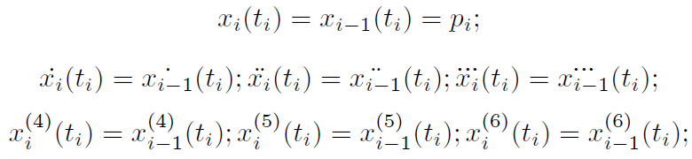
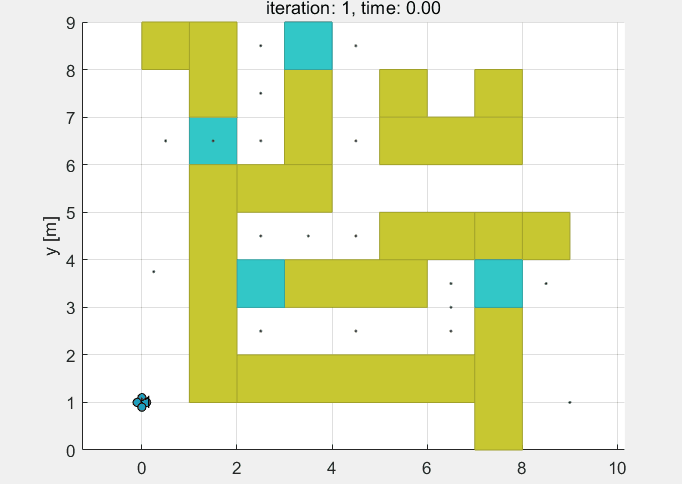
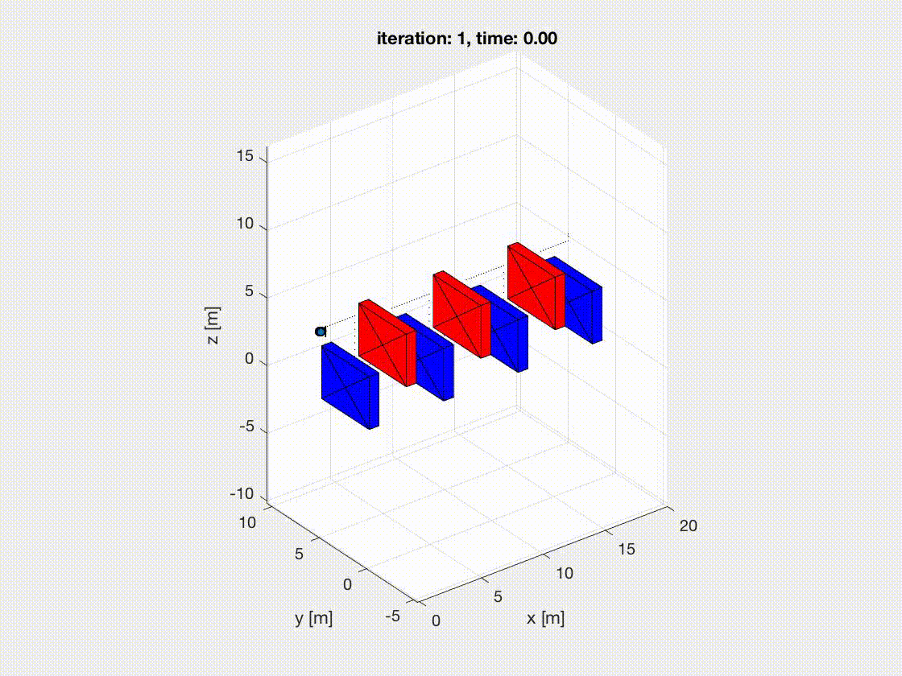

# quadrotor_trajectory_planning

### Run

Run `main.m` to start the program.

`traj_opt7.m` is key file to generate a trajectory. The current algorithm use a 7-order piecewise polynomial to generate a smooth trajectory. Constrains are listed below:

### Examples

